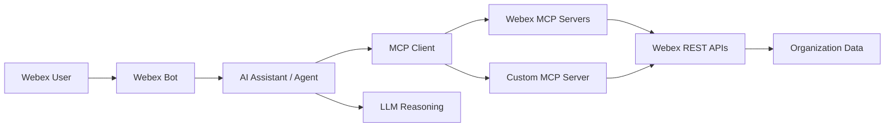

# Overview

## Lab Description

**Building an AI Assistant to Manage and Troubleshoot Your Organization**

In this hands-on session, participants will learn how to build an AI assistant using Webex Model Context Protocol (MCP) servers to retrieve and manage organizational data. Attendees will integrate their AI assistant with a Webex Bot and learn how to expand its capabilities by building a custom MCP server leveraging Webex APIs.

This session covers:

- Understanding and utilizing MCP servers within your IDE
- Integrating an AI Assistant with a Webex Bot
- Developing a custom MCP server to unlock new functionalities

## Architecture at a Glance



**User → Webex Bot → AI Assistant → MCP Tool → Webex API → Response**

The bot is the interaction channel. The agent is the system that reasons, selects tools, and orchestrates workflows behind the bot.

## Learning Objectives

Upon completion of this lab, you will be able to:

- Explain the difference between a web chat interface, an IDE-embedded assistant, and an operational AI agent
- Configure official Webex MCP servers in Visual Studio Code and drive the assistant with **OpenAI** models (API key provided for the lab)
- Use MCP tools, resources, and prompts to manage and troubleshoot Webex organization data
- Connect a Webex Bot to an AI assistant for interactive troubleshooting workflows
- Apply Agent Skills to encode operational runbooks and best practices
- Build a custom MCP server that exposes Webex API operations as tools
- Execute an end-to-end troubleshooting scenario (status check, audit review, reporting)

## Disclaimer

Although the lab design and configuration examples could be used as a reference, for design-related questions, please contact your representative at Cisco or a Cisco partner.

# Getting Started

Welcome to **LAB-31123: Troubleshoot and Manage Your Organization with an AI Assistant**. This section prepares your lab workstation, credentials, and development environment.

## Join the conversation!

Scan the QR code to be added to the Webex space for Q&A and more.

{ width="300" style="display: block; margin: 0 auto; border: 1px solid lightgray; border-radius: 8px;"}

## Tools used in this lab

- **Webex Client** — interact with your bot and verify assistant responses
- **Visual Studio Code** — edit code, configure MCP servers, and run the lab assistant from the terminal
- **OpenAI API** — LLM for the bot and agent (key provided by your instructor; **not** GitHub Copilot)
- **Webex for Developers** — create bots, WCIT tokens, and review API documentation
- **Python 3.10+** — run bot, OpenAI, and MCP client samples

## Webex lab credentials

Use the credentials provided by your lab instructor:

| Item | Value |
| --- | --- |
| Username | `userX@webexone-ai-assistant.wbx.ai` (replace X with your pod number) |
| Password | Provided in the lab handout |

## Webex Client

To begin, you'll log into your dedicated Webex lab account. This will allow you to see the results of your exercises and interact with your assistant.

1. **Open the Webex Client:** Launch the Webex Desktop App on your lab workstation.
2. **Enter Lab Credentials:** When prompted, enter the **Webex email address and password** provided to you.

!!! Note
    You can also log in at [Webex](https://web.webex.com/){:target="_blank"} 

## Visual Studio

Visual Studio Code will be used for Python-based bot development, service app configuration, and the agentic app and MCP server exercises.

1. Open Visual Studio Code from the desktop:

   { width="150" style="display: block; margin: 0 auto; border: 1px solid lightgray; border-radius: 8px;"}

### Clone the lab repository

2. Go to the **Source Control** tab and click **Clone Repository**:

    { width="500" style="display: block; margin: 0 auto; border: 1px solid lightgray; border-radius: 8px;"}

3. Type the following URL:

    - https://github.com/diegomjimenez/WebexOne2026.git

    { width="600" style="display: block; margin: 0 auto; border: 1px solid lightgray; border-radius: 8px;"}

4. Select a directory to save the project.
5. Click on **Yes, I trust the authors** if a pop-up appears.

### Virtual Environment

6. Create a virtual environment and install dependencies:

    ```bash
    python -m venv .venv
    .\webexone2026\Scripts\activate.ps1
    pip install -r requirements.txt
    ```

7. Copy the environment template and fill in your values:

    ```bash
    cp .env.example .env
    ```

### Chat

8. Open the Command Palette (`Ctrl+Shift+P`) and type "Chat: Open Chat (Agent)".

    { width="600" style="display: block; margin: 0 auto; border: 1px solid lightgray; border-radius: 8px;"}

    The Chat should open on the side:

    { width="400" style="display: block; margin: 0 auto; border: 1px solid lightgray; border-radius: 8px;"}

### Bruno / Postman
