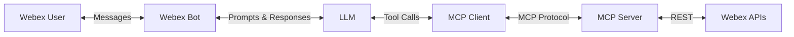
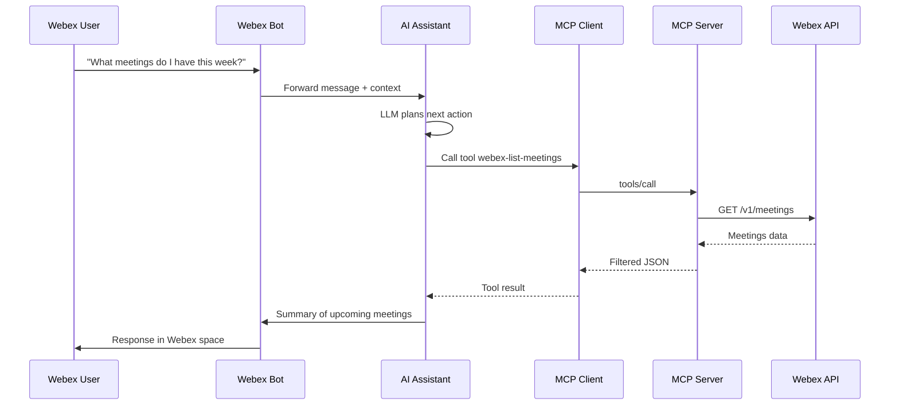
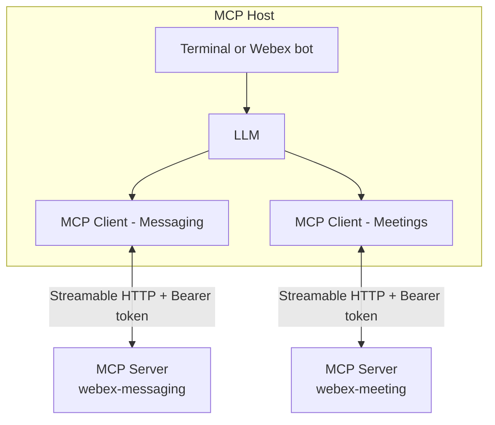
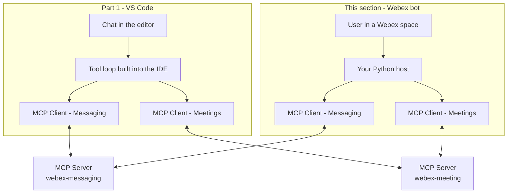

# Lab 4 - MCP Servers in AI Assistant

Now that we have already built our AI assistant, we need to give it MCP capabilities to access our organization.

## What is MCP?

The Model Context Protocol (MCP) is an open standard that connects AI models to data sources and tools. Instead of writing custom API integrations for every LLM, you write one MCP server. Any MCP-compatible host (like VS Code, Claude Desktop, or your own bot) can connect to it.
MCP defines three core primitives:

| Primitive | Controlled by | Purpose | Side effects |
| --- | --- | --- | --- |
| **Tools** | Model (on demand) | Take action — call APIs, run scripts | Yes |
| **Resources** | Client (automatic) | Read-only context — schemas, policies | No |
| **Prompts** | User (explicit) | Reusable multi-step workflow templates | No |

### Tools

In this lab, we are building a Webex bot that acts as an assistant. When a user asks a question, the LLM needs to decide what to do (like looking up meetings or searching spaces) and then do it. 
That makes **Tools** the perfect fit. The model chooses which tool to call and supplies the arguments. We will not use Resources (which are usually injected automatically by IDEs) or Prompts (which are usually picked by a user from a menu).

When our bot connects to a server, this is what happens:

1. `tools/list` → The bot receives the name, description, and JSON schema for every tool.
2. The bot passes those schemas to the LLM.
3. The LLM selects a tool and supplies arguments based on the user's chat message.
4. `tools/call` → The bot sends the call to the server.
5. The server validates the request, calls the backend Webex API, and returns JSON.
6. The bot gives that JSON back to the LLM to write the final reply.

## Architecture



### The Request Flow

Here is how a single question travels through that architecture:



## Step 4.1: Build the MCP Client

These are the MCP components used in this section:

| Component | Role | In this section |
| --- | --- | --- |
| **Host** | App that creates MCP clients (later also LLM / bot) | Python scripts and Webex bot |
| **Client** | One session, one server, one token | `McpClient` |
| **Server** | Exposes tools (and resources/prompts) | Hosted Webex Messaging MCP and Meetings MCP |



To integrate the Webex MCP Servers into your Assistant, you need an MCP Client.

1. Navigate to `04_mcp/mcp_client.py` and review the code:

    ??? Tip "Python Code"
        ```python
        import logging
        import traceback
        from contextlib import asynccontextmanager
        
        from mcp import ClientSession
        from mcp.client.streamable_http import streamable_http_client
        from mcp.shared._httpx_utils import create_mcp_http_client
        
        logging.getLogger("mcp.client.streamable_http").addFilter(
            lambda record: "Error parsing SSE message" not in record.getMessage()
        )
        
        
        class McpClient:
            """One MCP session = one server URL + that server's token."""
        
            def __init__(self, access_token, url):
                self.access_token = access_token
                self.url = url
        
            @asynccontextmanager
            async def session(self):
                http = create_mcp_http_client(headers={"Authorization": f"Bearer {self.access_token}"})
                async with http:
                    async with streamable_http_client(self.url, http_client=http) as (read, write):
                        async with ClientSession(read, write) as session:
                            await session.initialize()
                            yield session
        
            async def list_tools(self):
                try:
                    async with self.session() as session:
                        return (await session.list_tools()).tools
                except Exception as e:
                    # The SDK runs the transport in a task group, so the real error is nested.
                    traceback.print_exception(e, limit=0)
                    return []
        
            async def call_tool(self, name, arguments=None):
                try:
                    async with self.session() as session:
                        result = await session.call_tool(name, arguments or {})
                        texts = [c.text for c in result.content if getattr(c, "type", None) == "text"]
                        return "\n".join(texts) if texts else str(result.content)
                except Exception as e:
                    traceback.print_exception(e, limit=0)
                    return None
        ```

   This MCP client allows you to connect to any MCP server.

## Step 4.2: List tools

Now, we will connect to the MCP server using the client. In this first exercise, we will list the Tools available in the Webex Meetings MCP server.

1. Navigate to `04_mcp/01_list_tools.py` and review the code:

    ??? Tip "Python Code"
        ```python
        import asyncio
        import logging
        import os
        
        from dotenv import load_dotenv
        
        from mcp_client import McpClient
        
        try:
            import truststore
        
            truststore.inject_into_ssl()
        except ImportError:
            pass
        
        MEETING_MCP_URL = "https://mcp.webexapis.com/mcp/webex-meeting"
        
        logging.basicConfig(level=logging.INFO, format="%(asctime)s %(levelname)s %(message)s")
        log = logging.getLogger("mcp-list-tools")
        
        load_dotenv()
        
        MEETING_TOKEN = os.getenv("WEBEX_MEETING_MCP_TOKEN")
        if not MEETING_TOKEN:
            raise SystemExit("Set WEBEX_MEETING_MCP_TOKEN in your .env file")
        
        
        async def main():
            tools = await McpClient(MEETING_TOKEN, MEETING_MCP_URL).list_tools()
            if not tools:
                return
            log.info(f"{len(tools)} tool(s) from {MEETING_MCP_URL}")
            for tool in tools:
                log.info(f"  - {tool.name}: {tool.description}")
        
        
        if __name__ == "__main__":
            asyncio.run(main())
        ```

2. In VS Code, change your terminal to the correct folder:

    * cd ../04_mcp

3. Open the `.env` file at the root of your project and copy the Webex MCP Tokens into it:

    ```env
    WEBEX_MEETING_MCP_URL=https://mcp.webexapis.com/mcp/webex-meeting
    WEBEX_MEETING_MCP_TOKEN=your_meetings_mcp_token
    ```

4. Run your code with the following command:

    * python 01_list_tools.py

5. You will see the following in the terminal:

    ```terminal
    2026-09-15 11:09:39,412 INFO 8 tool(s) from https://mcp.webexapis.com/mcp/webex-meeting
    2026-09-15 11:09:39,412 INFO   - webex-list-meetings: List Webex meetings for the authenticated user. Returns meeting details including meeting number, topic, start/end time, host info, and optionally the full invitee list with pagination. Meetings are streamed progressively as result chunks during fetch and returned as a complete array in the final response. Filter by date range, meeting number, topic keyword, meetingType, or state. The returned &#39;id&#39; field is the meetingId used to identify a specific meeting. Use meetingType&#61;&#39;meeting&#39; and state&#61;&#39;ended&#39; to find ended meeting instances. Default meetingType is &#39;meetingSeries&#39; which returns upcoming recurring meetings. Invitees are fully paginated (no truncation). Rate-limited API calls are retried automatically.
    2026-09-15 11:09:39,412 INFO   - webex-create-meeting: Create a new Webex meeting. Requires a title and start time. Optionally specify end time or duration, invitees, recurrence pattern, timezone, and meeting password. Returns the created meeting details including meeting number, join link, and SIP address.
    2026-09-15 11:09:39,412 INFO   - webex-update-meeting: Update properties of an existing Webex meeting and/or manage invitees in one call. Requires meetingId (available from webex-list-meetings). Meeting property updates are partial: only provided fields are changed. Invitee operations support add, update role/displayName, and remove by email. Best-effort behavior: if multiple operations are requested, successful operations are returned along with per-operation errors.
    2026-09-15 11:09:39,412 INFO   - webex-delete-meeting: Delete a scheduled Webex meeting by meeting ID (available from webex-list-meetings). Optionally send cancellation email to attendees (sendEmail, default true). Admin users can delete on behalf of a host using hostEmail.
    2026-09-15 11:09:39,412 INFO   - webex-get-meeting-status: Retrieve meeting details and optionally fetch all participants. Supported meetingId types are meeting series ID, scheduled meeting ID, and meeting instance ID (in-progress or ended). When participants are included, all participants are fetched across all pages and streamed as result chunks. Participant data is available when the caller is the meeting host; attendees may not have access to participant details even when meeting details are visible. Use includeParticipants&#61;false to fetch meeting status only when participant access is restricted.
    2026-09-15 11:09:39,413 INFO   - webex-get-meeting-summary: Retrieve the AI-generated summary and action items for an ended Webex meeting. Requires a meetingId from an ended meeting instance (available from webex-list-meetings with meetingType&#61;&#39;meeting&#39; and state&#61;&#39;ended&#39;). Returns HTML summary notes and a list of action items in plaintext. Only works for meetings where Webex AI Assistant was enabled. Not supported for Webex for Government (FedRAMP). Only summaries for meetings hosted by or shared with the authenticated user can be retrieved. Summaries for meetings the user merely attended (but did not host) are not accessible unless the host has explicitly shared the meeting content.
    2026-09-15 11:09:39,413 INFO   - webex-list-recordings: List meeting recording metadata and access URLs (playback link, download link). Returns metadata only — not video content. Automatically paginates through all results using Link:rel&#61;next until the total reaches the &#39;max&#39; limit. Each recording is streamed as a chunk for real-time progress, and the full array is included in the final response. Retries automatically on rate limits (HTTP 429). Filter by meetingId to find recordings for a specific meeting (accepts any ID type: series, scheduled, or instance; available from webex-list-meetings). Only recordings of meetings hosted by or shared with the authenticated user are returned. Recordings for meetings the user merely attended (but did not host) will not appear unless the host has explicitly shared the recording.
    2026-09-15 11:09:39,413 INFO   - webex-list-transcripts: List all accessible transcripts, including Meeting Transcripts generated by Webex/Cisco AI Assistant or Closed Captions and transcripts attached to meeting recordings. For Meeting Transcript content, the tool downloads and locally parses the complete VTT from the exact vttDownloadLink returned by Webex; only if that fails does it paginate the snippets API. It then lists recordings and retrieves recording details only for meetings without a usable Meeting Transcript. Meeting Transcripts take precedence so the same meeting is not returned again from the recording source. If both VTT and snippets content retrieval fail, an available recording transcript replaces it as fallback. Multiple recording parts for one meeting are combined chronologically into one result. If recording discovery is unavailable after Meeting Transcripts were retrieved, those results are preserved and data.warnings reports that recording-backed results may be incomplete. Automatically paginates list APIs up to &#39;max&#39;, retries HTTP 429 responses, and optionally includes transcript content. Only meetings hosted by or shared with the authenticated user are returned.
    ```

    The 8 tools available are printed there.
   
## Step 4.3: Call a specific tool

Now that we have listed the tools, we will write the code that actually calls a tool. In this example, we will call "webex-list-meetings".

1. Navigate to `04_mcp/02_list_meetings.py` and review the code:

    ??? Tip "Python Code"
        ```python
        import asyncio
        import logging
        import os
        from datetime import datetime, timedelta, timezone
        
        from dotenv import load_dotenv
        
        from mcp_client import McpClient
        
        try:
            import truststore
        
            truststore.inject_into_ssl()
        except ImportError:
            pass
        
        MEETING_MCP_URL = "https://mcp.webexapis.com/mcp/webex-meeting"
        
        logging.basicConfig(level=logging.INFO, format="%(asctime)s %(levelname)s %(message)s")
        log = logging.getLogger("mcp-list-meetings")
        
        load_dotenv()
        
        MEETING_TOKEN = os.getenv("WEBEX_MEETING_MCP_TOKEN")
        if not MEETING_TOKEN:
            raise SystemExit("Set WEBEX_MEETING_MCP_TOKEN in your .env file")
        
        
        async def main():
            now = datetime.now(timezone.utc)
            arguments = {
                "from": now.strftime("%Y-%m-%dT00:00:00Z"),
                "to": (now + timedelta(days=7)).strftime("%Y-%m-%dT23:59:59Z"),
                "meetingType": "scheduledMeeting",
            }
            log.info(f"Calling webex-list-meetings {arguments}")
            result = await McpClient(MEETING_TOKEN, MEETING_MCP_URL).call_tool(
                "webex-list-meetings",
                arguments,
            )
            if not result:
                return
            log.info(result)
        
        
        if __name__ == "__main__":
            asyncio.run(main())
        ```

2. Run your code with the following command:

    * python 02_list_meetings.py

3. You should see the meeting scheduled in Lab 1:

   ```terminal
   2026-09-14 19:28:03,729 INFO {"data":{"meetings":[{"id":"cd9966d90d5a43bfa8e002f6e8b6aa4e","meetingNumber":"26604791633","title":"Meeting with user1@webexone-ai-assistant.wbx.ai","start":"2026-09-15T16:00:00Z","end":"2026-09-15T17:00:00Z","state":"ready","meetingType":"scheduledMeeting","timezone":"UTC","hostDisplayName":"admin@webexone-ai-assistant.wbx.ai","hostEmail":"admin@webexone-ai-assistant.wbx.ai","webLink":"https://webexone-ai-assistant-sbx.webex.com/webexone-ai-assistant-sbx/j.php?MTID=mea0739a573d6ff87dbab949d46715c08","sipAddress":"26604791633@webexone-ai-assistant-sbx.webex.com","invitees":[{"id":"cd9966d90d5a43bfa8e002f6e8b6aa4e_4266817701","email":"user1@webexone-ai-assistant.wbx.ai","displayName":"user1@webexone-ai-assistant.wbx.ai","coHost":false,"panelist":false}]}],"count":1,"totalMeetings":1},"success":true}
   ```

   In this case, we have printed the raw information that the tool returned.

## Step 4.4: Use an LLM to call

In this scenario, the LLM will choose which tool to use from the catalog. We will make a query in natural language, and the LLM will decide which tool from the list is needed to get that information. The LLM will then process the result and reply to us in natural language.

!!! Note
    Our query will be a constant inside the code.

1. Navigate to `04_mcp/llm.py` and review the code. We will use this module from now on as a wrapper to call OpenAI:

    ??? Tip "Python Code"
        ```python
        import asyncio
        import json
        import logging
        import os
        
        import requests
        
        OPENAI_URL = "https://api.openai.com/v1/chat/completions"
        MAX_STEPS = 5
        
        log = logging.getLogger("mcp-llm")
        
        
        def ask_llm(messages, tools):
            """One Chat Completions round. Returns the assistant message (text or tool calls)."""
            response = requests.post(
                OPENAI_URL,
                headers={
                    "Authorization": f"Bearer {os.getenv('OPENAI_API_KEY')}",
                    "Content-Type": "application/json",
                },
                json={
                    "model": os.getenv("OPENAI_MODEL", "gpt-5-nano"),
                    "messages": messages,
                    "tools": tools,
                },
                timeout=60,
            )
            response.raise_for_status()
            return response.json()["choices"][0]["message"]
        
        
        def as_openai_tools(mcp_tools):
            # An MCP tool already describes itself with a JSON schema, which is what OpenAI wants.
            return [
                {
                    "type": "function",
                    "function": {
                        "name": tool.name,
                        "description": tool.description,
                        "parameters": tool.input_schema,
                    },
                }
                for tool in mcp_tools
            ]
        
        
        async def run_turn(mcp, messages, tools, max_steps=MAX_STEPS):
            for _ in range(max_steps):
                message = await asyncio.to_thread(ask_llm, messages, tools)
                messages.append(message)
        
                tool_calls = message.get("tool_calls")
                if not tool_calls:
                    return message.get("content") or "(no answer)"
        
                for call in tool_calls:
                    name = call["function"]["name"]
                    arguments = json.loads(call["function"]["arguments"] or "{}")
                    log.info(f"LLM asked for {name} {arguments}")
                    result = await mcp.call_tool(name, arguments)
                    messages.append(
                        {"role": "tool", "tool_call_id": call["id"], "content": result or "Tool error"}
                    )
        
            return f"Stopped after {max_steps} tool steps without a final answer."
        ```

2. Navigate to `04_mcp/03_llm.py` and review the code:

    ??? Tip "Python Code"
        ```python
        import asyncio
        import logging
        import os
        from datetime import datetime, timezone
        
        from dotenv import load_dotenv
        
        from llm import as_openai_tools, run_turn
        from mcp_client import McpClient
        
        try:
            import truststore
        
            truststore.inject_into_ssl()
        except ImportError:
            pass
        
        MEETING_MCP_URL = "https://mcp.webexapis.com/mcp/webex-meeting"
        QUESTION = "What meetings do I have scheduled this week?"
        
        logging.basicConfig(level=logging.INFO, format="%(asctime)s %(levelname)s %(message)s")
        log = logging.getLogger("mcp-llm")
        
        load_dotenv()
        
        MEETING_TOKEN = os.getenv("WEBEX_MEETING_MCP_TOKEN")
        OPENAI_API_KEY = os.getenv("OPENAI_API_KEY")
        OPENAI_MODEL = os.getenv("OPENAI_MODEL", "gpt-5-nano")
        if not MEETING_TOKEN:
            raise SystemExit("Set WEBEX_MEETING_MCP_TOKEN in your .env file")
        if not OPENAI_API_KEY:
            raise SystemExit("Set OPENAI_API_KEY in your .env file")
        
        
        async def main():
            client = McpClient(MEETING_TOKEN, MEETING_MCP_URL)
            tools = as_openai_tools(await client.list_tools())
            log.info(f"Offering {len(tools)} Meetings MCP tool(s) to {OPENAI_MODEL}")
        
            today = datetime.now(timezone.utc).strftime("%Y-%m-%d")
            messages = [
                {
                    "role": "system",
                    "content": (
                        f"You help a Webex user with their meetings. Today is {today} (UTC). "
                        "Answer only from tool results, never from memory, and keep replies short."
                    ),
                },
                {"role": "user", "content": QUESTION},
            ]
            return await run_turn(client, messages, tools)
        
        
        if __name__ == "__main__":
            log.info(f"Question: {QUESTION}")
            log.info(asyncio.run(main()))
        ```

3. Open the `.env` file at the root of your project and set the `OPENAI_API_KEY`:

    ```env
    OPENAI_API_KEY=
    ```

4. Run your code with the following command:

    * python 03_llm.py

5. You should see in the console how tools were offered to the model, which one it picked, and its answer:

    ``` terminal
    2026-09-15 11:14:54,415 INFO Offering 8 Meetings MCP tool(s) to gpt-5-nano
    2026-09-15 11:15:02,662 INFO LLM asked for webex-list-meetings {'from': '2026-09-14T00:00:00Z', 'to': '2026-09-21T00:00:00Z', 'max': 100, 'includeParticipants': False}
    ...
    2026-09-15 11:15:33,840 INFO Here’s what you have this week:

    - Meeting: Meeting with user1@webexone-ai-assistant.wbx.ai
      - When: 2026-09-15 16:00–17:00 UTC
      - Meeting number: 26604791633
      - Host: admin@webexone-ai-assistant.wbx.ai
      - Join: https://webexone-ai-assistant-sbx.webex.com/webexone-ai-assistant-sbx/j.php?MTID=m4bc7e596e836eadff3446f07b1379e7e
      - SIP: 26604791633@webexone-ai-assistant-sbx.webex.com
    
    Want me to add this to your calendar or share the invite?
    ```

## Step 4.5: Hub

So far we have only added one Webex Meeting MCP Server. Now, we will also add the Webex Messaging MCP server. The LLM won't pick a server; it only picks a tool name, as all tools are going to be presented together. We will introduce the class `McpHub`, which lists tools from every server as one combined list and, when the model calls a name, routes that call to the right client.

1. Navigate to `04_mcp/mcp_hub.py` and review the code:

    ??? Tip "Python Code"
        ```python
        from mcp_client import McpClient
        
        
        class McpHub:
            def __init__(self, servers):
                self.clients = [McpClient(token, url) for url, token in servers if token]
                self._by_name = {}
        
            async def list_tools(self):
                tools = []
                self._by_name = {}
                for client in self.clients:
                    for tool in await client.list_tools():
                        self._by_name[tool.name] = client
                        tools.append(tool)
                return tools
        
            async def call_tool(self, name, arguments=None):
                if name not in self._by_name:
                    await self.list_tools()
                client = self._by_name.get(name)
                if client is None:
                    raise KeyError(f"Unknown MCP tool: {name}")
                return await client.call_tool(name, arguments)
        ```

    !!! Note "Configuration-Driven Architecture"
        In this lab, we are hardcoding the MCP Server URLs (e.g., `https://mcp.webexapis.com/mcp/webex-messaging`) directly in our Python scripts so you can clearly see the flow of data. 

        In a production environment, a hub like this should be **configuration-driven**. Instead of hardcoding URLs, your bot would read a configuration file (like the `mcp.json` used by VS Code) or load a list of active servers from a database or `.env` file. This allows administrators to add, remove, or update MCP servers without modifying the bot's source code.

2. Navigate to `04_mcp/04_hub.py` and review the code. In this exercise, we will ask two questions to the LLM: one related to My Meetings and another related to My Spaces.

    ??? Tip "Python Code"
        ```python
        import asyncio
        import logging
        import os
        from datetime import datetime, timezone
        
        from dotenv import load_dotenv
        
        from llm import as_openai_tools, run_turn
        from mcp_hub import McpHub
        
        try:
            import truststore
        
            truststore.inject_into_ssl()
        except ImportError:
            pass
        
        MESSAGING_MCP_URL = "https://mcp.webexapis.com/mcp/webex-messaging"
        MEETING_MCP_URL = "https://mcp.webexapis.com/mcp/webex-meeting"
        QUESTION = "What meetings do I have this week, and how many spaces do I have?"
        
        logging.basicConfig(level=logging.INFO, format="%(asctime)s %(levelname)s %(message)s")
        log = logging.getLogger("mcp-hub")
        
        load_dotenv()
        
        MESSAGING_TOKEN = os.getenv("WEBEX_MESSAGING_MCP_TOKEN")
        MEETING_TOKEN = os.getenv("WEBEX_MEETING_MCP_TOKEN")
        OPENAI_API_KEY = os.getenv("OPENAI_API_KEY")
        OPENAI_MODEL = os.getenv("OPENAI_MODEL", "gpt-5-nano")
        if not OPENAI_API_KEY:
            raise SystemExit("Set OPENAI_API_KEY in your .env file")
        if not MESSAGING_TOKEN and not MEETING_TOKEN:
            raise SystemExit(
                "Set WEBEX_MESSAGING_MCP_TOKEN and/or WEBEX_MEETING_MCP_TOKEN in your .env file"
            )
        
        
        async def main():
            hub = McpHub(
                [
                    (MESSAGING_MCP_URL, MESSAGING_TOKEN),
                    (MEETING_MCP_URL, MEETING_TOKEN),
                ]
            )
            tools = as_openai_tools(await hub.list_tools())
            log.info(f"Offering {len(tools)} tool(s) from {len(hub.clients)} MCP server(s) to {OPENAI_MODEL}")
        
            today = datetime.now(timezone.utc).strftime("%Y-%m-%d")
            messages = [
                {
                    "role": "system",
                    "content": (
                        f"You help a Webex user with messaging and meetings. Today is {today} (UTC). "
                        "Answer only from tool results, never from memory, and keep replies short."
                    ),
                },
                {"role": "user", "content": QUESTION},
            ]
            return await run_turn(hub, messages, tools)
        
        
        if __name__ == "__main__":
            log.info(f"Question: {QUESTION}")
            log.info(asyncio.run(main()))
        ```

3. Open the `.env` file at the root of your project and set the `WEBEX_MESSAGING_MCP_TOKEN` if you didn't do it before:

    ```env
    WEBEX_MESSAGING_MCP_URL=https://mcp.webexapis.com/mcp/webex-messaging
    WEBEX_MESSAGING_MCP_TOKEN=your_messaging_mcp_token
    ```

4. Run your code with the following command:

    * python 04_hub.py

5. You should see now that the tools were combined together. The LLM decided to make two different calls (one for each part of the question), and then it combined the answers in natural language.

    ```terminal
    2026-09-15 11:43:47,642 INFO Question: What meetings do I have this week, and how many spaces do I have?
    ...
    2026-09-15 11:44:16,109 INFO Offering 32 tool(s) from 2 MCP server(s) to gpt-5-nano
    2026-09-15 11:44:24,942 INFO LLM asked for webex-list-meetings {'from': '2026-09-14T00:00:00Z', 'to': '2026-09-21T00:00:00Z', 'max': 100}
    ...
    2026-09-15 11:44:34,230 INFO LLM asked for webex-search-spaces {'max': 200}
    ...
    2026-09-15 11:47:52,401 INFO Here’s what I found:

    - This week’s meetings (UTC window 2026-09-14 to 2026-09-21):
      - 1 meeting: Meeting with user1@webexone-ai-assistant.wbx.ai
        - Start: 2026-09-15 16:00 UTC
        - End: 2026-09-15 17:00 UTC
        - Meeting number: 26604791633
        - Status: active
    
    - Spaces: 2 total
      - Direct: WebexOne-diejimen
      - Group: WebexOne - Diejimen
    
    Want me to pull more details or set reminders?
    ```

## Step 4.6: Integration with the Bot

Now, as we did in the previous section, we will combine what we have done to provide direct access from a Webex Bot.

1. Navigate to `04_mcp/05_bot.py` and review the code:

    ??? Tip "Python Code"
        ```python
        import asyncio
        import logging
        import os
        import sys
        from datetime import datetime, timezone
        from pathlib import Path
        
        from dotenv import load_dotenv
        
        from llm import as_openai_tools, run_turn
        from mcp_hub import McpHub
        
        sys.path.insert(0, str(Path(__file__).resolve().parent.parent / "03_bot"))
        from websocket_client import WebSocketClient
        
        try:
            import truststore
        
            truststore.inject_into_ssl()
        except ImportError:
            pass
        
        MESSAGING_MCP_URL = "https://mcp.webexapis.com/mcp/webex-messaging"
        MEETING_MCP_URL = "https://mcp.webexapis.com/mcp/webex-meeting"
        ERROR_REPLY = "Sorry, I could not answer that right now. Please try again in a moment."
        
        logging.basicConfig(level=logging.INFO, format="%(asctime)s %(levelname)s %(message)s")
        log = logging.getLogger("mcp-bot")
        
        load_dotenv()
        
        BOT_TOKEN = os.getenv("BOT_TOKEN")
        MESSAGING_TOKEN = os.getenv("WEBEX_MESSAGING_MCP_TOKEN")
        MEETING_TOKEN = os.getenv("WEBEX_MEETING_MCP_TOKEN")
        OPENAI_API_KEY = os.getenv("OPENAI_API_KEY")
        OPENAI_MODEL = os.getenv("OPENAI_MODEL", "gpt-5-nano")
        if not BOT_TOKEN:
            raise SystemExit("Set BOT_TOKEN in your .env file")
        if not OPENAI_API_KEY:
            raise SystemExit("Set OPENAI_API_KEY in your .env file")
        if not MESSAGING_TOKEN and not MEETING_TOKEN:
            raise SystemExit(
                "Set WEBEX_MESSAGING_MCP_TOKEN and/or WEBEX_MEETING_MCP_TOKEN in your .env file"
            )
        
        hub = McpHub(
            [
                (MESSAGING_MCP_URL, MESSAGING_TOKEN),
                (MEETING_MCP_URL, MEETING_TOKEN),
            ]
        )
        
        
        async def answer(question, sender):
            tools = as_openai_tools(await hub.list_tools())
            log.info(f"Offering {len(tools)} tool(s) from {len(hub.clients)} MCP server(s) to {OPENAI_MODEL}")
            today = datetime.now(timezone.utc).strftime("%Y-%m-%d")
            messages = [
                {
                    "role": "system",
                    "content": (
                        f"You are a Webex assistant helping {sender}. Today is {today} (UTC). "
                        "Answer only from tool results, never from memory, and reply in a short "
                        "friendly chat message."
                    ),
                },
                {"role": "user", "content": question},
            ]
            return await run_turn(hub, messages, tools)
        
        
        def handle_message(message):
            text = (message.get("text") or "").strip()
            if not text:
                return
        
            sender = message["personEmail"]
            log.info(f"Received from {sender}: {text}")
            asyncio.create_task(reply_with_assistant(message, sender, text))
        
        
        async def reply_with_assistant(message, sender, question):
            try:
                reply = await answer(question, sender)
            except Exception:
                log.exception("Assistant turn failed")
                reply = ERROR_REPLY
            bot.send_message(message["roomId"], reply)
            log.info(f"Sent to {sender}: {reply}")
        
        
        if __name__ == "__main__":
            bot = WebSocketClient(access_token=BOT_TOKEN, on_message=handle_message)
            log.info(f"Listening as {bot.me['emails'][0]} via WebSocket... (Ctrl+C to stop)")
            try:
                bot.run()
            except KeyboardInterrupt:
                log.info("Stopped.")
        ```

2. Make sure you have set the `BOT_TOKEN` in the `.env` file at the root of your project:

    ```env
    BOT_TOKEN=
    ```

3. Run your code with the following command:

    * python 05_bot.py

4. Ask your bot for the meetings that you have scheduled for tomorrow:

    { width="850" style="display: block; margin: 0 auto; border: 1px solid lightgray; border-radius: 8px;" }

5. In the console you will see the following:

    ```terminal
    2026-09-14 20:06:58,631 INFO Received from admin@webexone-ai-assistant.wbx.ai: What meetings do I have tomorrow?
    ...
    2026-09-15 11:58:47,999 INFO Offering 32 tool(s) from 2 MCP server(s) to gpt-5-nano
    2026-09-14 20:07:08,344 INFO LLM asked for webex-list-meetings {'from': '2026-09-15T00:00:00Z', 'to': '2026-09-16T00:00:00Z', 'max': 50, 'includeParticipants': False}
    ...
    2026-09-14 20:07:09,152 INFO HTTP Request: POST https://mcp.webexapis.com/mcp/webex-meeting "HTTP/1.1 200 OK"
    2026-09-14 20:07:09,152 INFO Received session ID: b909621b-a64c-4a33-979f-8be53f25e9e9
    2026-09-14 20:07:09,405 INFO HTTP Request: POST https://mcp.webexapis.com/mcp/webex-meeting "HTTP/1.1 202 Accepted"
    2026-09-14 20:07:11,683 INFO HTTP Request: POST https://mcp.webexapis.com/mcp/webex-meeting "HTTP/1.1 200 OK"
    2026-09-14 20:07:13,539 INFO HTTP Request: POST https://mcp.webexapis.com/mcp/webex-meeting "HTTP/1.1 200 OK"
    2026-09-14 20:07:14,831 INFO HTTP Request: DELETE https://mcp.webexapis.com/mcp/webex-meeting "HTTP/1.1 200 OK"
    2026-09-14 20:07:22,913 INFO Sent to admin@webexone-ai-assistant.wbx.ai: Tomorrow (2026-09-15) you have one meeting:
    
    - Title: Meeting with user1@webexone-ai-assistant.wbx.ai
    - Time: 16:00–17:00 UTC
    - Meeting number: 26604791633
    - Join link: https://webexone-ai-assistant-sbx.webex.com/webexone-ai-assistant-sbx/j.php?MTID=mea0739a573d6ff87dbab949d46715c08
    - Host: admin@webexone-ai-assistant.wbx.ai
    - SIP: 26604791633@webexone-ai-assistant-sbx.webex.com
    
    Would you like me to set a reminder or share invitees?
    ```

## Extra: Local Tool + Adaptive Card

In Webex, we also have the capability to use **Adaptive Cards**. Adaptive Cards allow us to format the message and add actions, such as a Join button on each meeting, instead of a long block of chat text.

In this exercise, we will do two things:

- Create the `send_meetings_card` function, that generates an Adaptive Card for the meetings.
- Give the LLM a local tool, so it can call this new function when it decides.

In this case, we have built a card that will be sent as a summary when we have meetings:

```json
{
    "type": "Container",
    "separator": True,
    "items": [
        {"type": "TextBlock", "text": meeting["title"], "weight": "Bolder", "wrap": True},
        {
            "type": "FactSet",
            "facts": [
                {"title": "When", "value": when(meeting)},
                {"title": "Host", "value": meeting.get("hostEmail", "unknown")},
            ],
        },
        {
            "type": "ActionSet",
            "actions": [
                {"type": "Action.OpenUrl", "title": "Join", "url": meeting["webLink"]}
            ],
        },
    ],
}
```

!!! Note "Buttons and Cards Designer"

    You can use the **Buttons and Cards Designer** to build your own:
    
    - [Buttons and Cards Designer](https://developer.webex.com/buttons-and-cards-designer){:target="_blank"}


1. Navigate to `04_mcp/06_card.py` and review the code. Take a look at how we have defined our local Tool and the system prompt attached to the LLM:

    ??? Tip "Python Code"
        ```python
        import asyncio
        import logging
        import os
        import sys
        from datetime import datetime, timezone
        from pathlib import Path
        
        import requests
        from dotenv import load_dotenv
        
        from llm import as_openai_tools, run_turn
        from mcp_hub import McpHub
        
        sys.path.insert(0, str(Path(__file__).resolve().parent.parent / "03_bot"))
        from websocket_client import WebSocketClient
        
        try:
            import truststore
        
            truststore.inject_into_ssl()
        except ImportError:
            pass
        
        MESSAGING_MCP_URL = "https://mcp.webexapis.com/mcp/webex-messaging"
        MEETING_MCP_URL = "https://mcp.webexapis.com/mcp/webex-meeting"
        MESSAGES_URL = "https://webexapis.com/v1/messages"
        CARD_CONTENT_TYPE = "application/vnd.microsoft.card.adaptive"
        ERROR_REPLY = "Sorry, I could not answer that right now. Please try again in a moment."
        SEND_MEETINGS_CARD = {
            "type": "function",
            "function": {
                "name": "send_meetings_card",
                "description": (
                    "Post an Adaptive Card in the Webex space with title, time, host, and a Join "
                    "button for each meeting. Call this after webex-list-meetings when "
                    "data.meetings is not empty. Pass that meetings array. Do not invent meetings."
                ),
                "parameters": {
                    "type": "object",
                    "properties": {
                        "meetings": {
                            "type": "array",
                            "description": "The meetings array from webex-list-meetings (data.meetings).",
                        }
                    },
                    "required": ["meetings"],
                },
            },
        }
        
        logging.basicConfig(level=logging.INFO, format="%(asctime)s %(levelname)s %(message)s")
        log = logging.getLogger("mcp-card-bot")
        
        load_dotenv()
        
        BOT_TOKEN = os.getenv("BOT_TOKEN")
        MESSAGING_TOKEN = os.getenv("WEBEX_MESSAGING_MCP_TOKEN")
        MEETING_TOKEN = os.getenv("WEBEX_MEETING_MCP_TOKEN")
        OPENAI_API_KEY = os.getenv("OPENAI_API_KEY")
        OPENAI_MODEL = os.getenv("OPENAI_MODEL", "gpt-5-nano")
        if not BOT_TOKEN:
            raise SystemExit("Set BOT_TOKEN in your .env file")
        if not OPENAI_API_KEY:
            raise SystemExit("Set OPENAI_API_KEY in your .env file")
        if not MESSAGING_TOKEN and not MEETING_TOKEN:
            raise SystemExit(
                "Set WEBEX_MESSAGING_MCP_TOKEN and/or WEBEX_MEETING_MCP_TOKEN in your .env file"
            )
        
        hub = McpHub(
            [
                (MESSAGING_MCP_URL, MESSAGING_TOKEN),
                (MEETING_MCP_URL, MEETING_TOKEN),
            ]
        )
        
        
        def when(meeting):
            start = datetime.fromisoformat(meeting["start"].replace("Z", "+00:00"))
            end = datetime.fromisoformat(meeting["end"].replace("Z", "+00:00"))
            return f"{start:%a %d %b %H:%M} - {end:%H:%M} UTC"
        
        
        def build_card(meetings):
            body = [
                {
                    "type": "TextBlock",
                    "text": f"Meetings in the next 7 days ({len(meetings)})",
                    "size": "Large",
                    "weight": "Bolder",
                    "wrap": True,
                }
            ]
            for meeting in meetings:
                body.append(
                    {
                        "type": "Container",
                        "separator": True,
                        "items": [
                            {"type": "TextBlock", "text": meeting["title"], "weight": "Bolder", "wrap": True},
                            {
                                "type": "FactSet",
                                "facts": [
                                    {"title": "When", "value": when(meeting)},
                                    {"title": "Host", "value": meeting.get("hostEmail", "unknown")},
                                ],
                            },
                            {
                                "type": "ActionSet",
                                "actions": [
                                    {"type": "Action.OpenUrl", "title": "Join", "url": meeting["webLink"]}
                                ],
                            },
                        ],
                    }
                )
            return {
                "$schema": "http://adaptivecards.io/schemas/adaptive-card.json",
                "type": "AdaptiveCard",
                "version": "1.3",
                "body": body,
            }
        
        
        def send_card(room_id, text, card):
            # A card rides along as an attachment; text is the fallback for clients that cannot render it.
            requests.post(
                MESSAGES_URL,
                headers={"Authorization": f"Bearer {BOT_TOKEN}"},
                json={
                    "roomId": room_id,
                    "text": text,
                    "attachments": [{"contentType": CARD_CONTENT_TYPE, "content": card}],
                },
                timeout=30,
            ).raise_for_status()
        
        
        async def answer(question, sender, room_id):
            tools = as_openai_tools(await hub.list_tools()) + [SEND_MEETINGS_CARD]
            log.info(f"Offering {len(tools)} tool(s) to {OPENAI_MODEL} (MCP + send_meetings_card)")
            posted = {"card": False}
        
            def send_meetings_card(arguments):
                meetings = arguments.get("meetings") or []
                if not meetings:
                    return "No meetings to put on a card. Reply in a short chat message instead."
                send_card(room_id, f"You have {len(meetings)} meeting(s)", build_card(meetings))
                posted["card"] = True
                log.info(f"Sent a card with {len(meetings)} meeting(s)")
                return "Adaptive Card posted in the space. Give a short confirmation; do not re-list the meetings."
        
            today = datetime.now(timezone.utc).strftime("%Y-%m-%d")
            messages = [
                {
                    "role": "system",
                    "content": (
                        f"You are a Webex assistant helping {sender}. Today is {today} (UTC). "
                        "Answer only from tool results, never from memory. "
                        "When webex-list-meetings returns meetings, call send_meetings_card with "
                        "that meetings array so the user gets Join buttons. "
                        "If there are no meetings, or the question is not about meetings, reply in chat."
                    ),
                },
                {"role": "user", "content": question},
            ]
            reply = await run_turn(hub, messages, tools, extra={"send_meetings_card": send_meetings_card})
            return reply, posted["card"]
        
        
        def handle_message(message):
            text = (message.get("text") or "").strip()
            if not text:
                return
        
            sender = message["personEmail"]
            log.info(f"Received from {sender}: {text}")
            asyncio.create_task(reply_with_assistant(message, sender, text))
        
        
        async def reply_with_assistant(message, sender, question):
            try:
                reply, posted_card = await answer(question, sender, message["roomId"])
            except Exception:
                log.exception("Assistant turn failed")
                bot.send_message(message["roomId"], ERROR_REPLY)
                return
            if posted_card:
                log.info(f"Card already sent to {sender}; LLM said: {reply}")
                return
            bot.send_message(message["roomId"], reply)
            log.info(f"Sent to {sender}: {reply}")
        
        
        if __name__ == "__main__":
            bot = WebSocketClient(access_token=BOT_TOKEN, on_message=handle_message)
            log.info(f"Listening as {bot.me['emails'][0]} via WebSocket... (Ctrl+C to stop)")
            try:
                bot.run()
            except KeyboardInterrupt:
                log.info("Stopped.")
        ```

2. Run your code with the following command:

    * python 06_card.py

3. Ask your bot about your meetings. You should see in the terminal that all tools were presented to the agent, and it chose first to list the meetings, and then to send the card.

    ```terminal
    2026-09-15 13:34:47,265 INFO Received from admin@webexone-ai-assistant.wbx.ai: What meetings do I have?
    ...
    2026-09-15 13:34:54,828 INFO Offering 33 tool(s) to gpt-5-nano (MCP + send_meetings_card)
    2026-09-15 13:35:01,261 INFO LLM asked for webex-list-meetings {}
    ...
    2026-09-15 13:35:16,198 INFO LLM asked for send_meetings_card {'meetings': [{'id': 'cd9966d90d5a43bfa8e002f6e8b6aa4e', 'meetingNumber': '26604791633', 'title': 'Meeting with user1@webexone-ai-assistant.wbx.ai', 'start': '2026-09-15T16:00:00Z', 'end': '2026-09-15T17:00:00Z', 'state': 'active', 'meetingType': 'meetingSeries', 'timezone': 'UTC', 'hostDisplayName': 'admin@webexone-ai-assistant.wbx.ai', 'hostEmail': 'admin@webexone-ai-assistant.wbx.ai', 'webLink': 'https://webexone-ai-assistant-sbx.webex.com/webexone-ai-assistant-sbx/j.php?MTID=m4bc7e596e836eadff3446f07b1379e7e', 'sipAddress': '26604791633@webexone-ai-assistant-sbx.webex.com', 'invitees': [{'id': 'cd9966d90d5a43bfa8e002f6e8b6aa4e_4266817701', 'email': 'user1@webexone-ai-assistant.wbx.ai', 'displayName': 'user1@webexone-ai-assistant.wbx.ai', 'coHost': False, 'panelist': False}]}], 'count': 1, 'totalMeetings': 1}
    ...
    2026-09-15 13:35:22,029 INFO Card already sent to admin@webexone-ai-assistant.wbx.ai; LLM said: A joinable meeting card has been posted in this space for your upcoming meeting. Open the card and click Join to attend.
    ```

4. You will receive the following card in your conversation:

    { width="650" style="display: block; margin: 0 auto; border: 1px solid lightgray; border-radius: 8px;" }

    If you press join, it will try to open the Webex App to join the meeting.

---

Now you have a bot that can access the Webex MCP servers. This still gives us some limitations: we need to adapt to the tools available, and the token will expire after 12 hours. In the next sections, we will explore how to work with those challenges.

## Extra: From the IDE to a bot

In the first part of this lab, you already used MCP **without writing a client**. You configured Webex Messaging and Meetings MCP in **VS Code** and asked an agent in the editor. That worked because the IDE **is** an MCP host.



The three MCP roles do not change. Only **who is the host** changes.

### How the IDE does it in the background

When you chat with the agent in VS Code:

1. The editor is the **host**. It owns the LLM and the UI.
2. For each MCP URL in your config, it opens a **client** (one session per server).
3. It calls `list_tools`, converts those tools into something the model understands, and runs the same loop we wrote by hand: model asks for a tool → host calls the server → result goes back to the model → the model answers in the chat panel.

You never saw `streamable_http_client` or `tool_calls` because the IDE hides them. The HTTP calls, the Bearer token, and the tool names are the same ones you used in `01`–`04`.

### Why that is not enough for a bot

The IDE assistant is **personal**. It runs on your laptop, for you. A colleague cannot open your VS Code window and ask it to list *their* spaces.

A **Webex bot** is a host that other people can reach: they message a bot in a 1:1 or a space, and your process answers. No IDE will do that for them. That is the reason this section exists.

| | VS Code agent | This section (custom bot) |
| --- | --- | --- |
| Host | The IDE | Your Python process |
| Who can use it | The person at that machine | Anyone who can message the bot |
| You write | Config (URL + token) | Client, hub, loop, WebSocket |
| Good for | Trying MCP, personal productivity | An assistant inside Webex |

### Is there another way to put MCP in Webex?

Yes, without a custom Python bot:

- **Webex AI / agentic apps.** An admin can enable Cisco-hosted MCP servers in [Collaboration Control Hub](https://developer.webex.com/mcp/docs/webex-mcp-server-overview){:target="_blank"} so the **Webex AI Assistant** (in the Webex app) can call those tools. Users stay in Webex; Cisco’s product is the host.
- **Other Microsoft / Cisco product hosts** (for example Copilot Studio) can also sit in front of MCP. Again you configure, you do not write the loop.

Those paths are the right choice when you want the **stock Webex assistant** to use Messaging or Meetings tools. They are **not** the right choice when you need:

- your own LLM and prompts
- allowlists (who may talk to the bot)
- Adaptive Cards or other custom replies
- tools mixed from Webex MCP **and** your own servers
- a bot identity you control (`WebexOne-*USERNAME*`)

That is why this lab builds the host: so the **bot** is the integration, not the IDE and not only Cisco’s built-in assistant.

### Frameworks

If you keep a custom bot but do not want to maintain the tool loop, agent frameworks wrap **exactly** what `03_llm` and `04_wrap` do:

| Framework | Role |
| --- | --- |
| **LangGraph** (via `langchain-mcp-adapters`) | Graph agents; `MultiServerMCPClient` ≈ our hub |
| **Semantic Kernel** | Native MCP client/server, multi-language |
| **OpenAI Agents SDK** | Small agents; MCP over stdio or HTTP |
| **Pydantic AI** | Typed Python agents with MCP toolsets |

The official MCP Python SDK also has a higher-level `Client` and a `ClientSessionGroup` that aggregates several servers — the same job as `mcp_hub.py`.

We still wrote the loop so you can see every call. In production, you can keep the Webex bot and the tokens, and swap the loop for a framework when you need memory, approvals, retries, or tracing.

!!! Note
    MCP support in IDEs and frameworks changes often. Check current docs before you standardise on one host.
