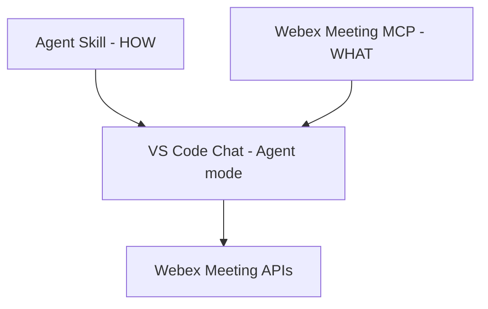

# Lab 2 - Agent Skills

In this section, you will use an **Agent Skill** to teach the assistant *how* to review Webex meetings thoroughly. This separates the operational expertise from the MCP tool connectivity, and you can run it directly inside **VS Code Chat (Agent mode)** without writing any code.

Skills aren't just fancy instructions—they're **portable, task-specific workflows** that load only when you need them. Unlike custom instructions that just define coding standards, skills bring scripts, examples, and automation into the mix to make agents truly **action-oriented**.

Instead of copying a file from the repository, you will create the skill yourself using the VS Code skills flow. VS Code will automatically save it to a supported location, ensuring the lab works regardless of which folder you have open.

## Skills vs MCP

| Layer            | Responsibility                                    | Example                                                                                   |
| ---------------- | ------------------------------------------------- | ----------------------------------------------------------------------------------------- |
| **MCP server**   | What the assistant *can do* — governed API access | Webex Meeting tools (list meetings, participants, summaries, recordings)                  |
| **Agent Skills** | *How* to use those tools — runbooks and judgment  | "For every meeting, also check participants, summary, recording, transcript, then triage" |



A skill doesn't add new tools. Instead, it tells the assistant **how to use the tools it already has more effectively**—and what *not* to do.

## Skills vs Custom Instructions

If you already use `.github/copilot-instructions.md` or custom instructions in VS Code, you might be wondering how skills are different. They actually serve different purposes:

| Feature      | Custom Instructions                  | Agent Skills                                                                          |
| ------------ | ------------------------------------ | ------------------------------------------------------------------------------------- |
| **Purpose**  | Coding standards and guidelines      | Task-specific workflows and runbooks                                                  |
| **Scope**    | Always applied to every conversation | Loaded on demand when the task matches                                                |
| **Content**  | Instructions only                    | Instructions + scripts + examples + resources                                         |
| **Standard** | VS Code–specific                     | Open standard ([agentskills.io](https://agentskills.io)) — portable across 30+ agents |

## Step 2.1: Enable Agent Skills

!!! Note "Prerequisite: Webex Meeting MCP"
    This lab relies on the **Webex Meeting MCP server** you configured in Lab 1. Before proceeding, make sure it is still present in your `mcp.json` file and running in VS Code (you can verify this via the **MCP: List Servers** command).

### Enable Agent Skills

1. Open **Settings** (`Ctrl+,`) and search for `chat.useAgentSkills`.
2. **Enable** the checkbox if it is not already enabled.
3. Reload the window: `Ctrl+Shift+P` → `Developer: Reload Window`.

### Where skills live

VS Code automatically scans these project directories for skills ([VS Code docs](https://code.visualstudio.com/docs/agent-customization/agent-skills)):

| Location          | Convention                         |
| ----------------- | ---------------------------------- |
| `.agents/skills/` | agentskills.io cross-host standard |
| `.github/skills/` | GitHub convention                  |
| `.claude/skills/` | Anthropic convention               |

## Step 2.2: Create the skill

A skill is simply a folder containing a `SKILL.md` file, following an open standard defined by [agentskills.io](https://agentskills.io/home).

1. In the Chat view, type `/skills` and press Enter to open the **Configure
   Skills** menu.

   { width="450" style="display: block; margin: 0 auto; border: 1px solid lightgray; border-radius: 8px;"}

   { width="450" style="display: block; margin: 0 auto; border: 1px solid lightgray; border-radius: 8px;"}

   { width="450" style="display: block; margin: 0 auto; border: 1px solid lightgray; border-radius: 8px;"}

2. Choose to create a **New Skill**, pick **User** scope, and name it exactly:

    ```text
    meeting-review
    ```
    
    { width="450" style="display: block; margin: 0 auto; border: 1px solid lightgray; border-radius: 8px;"}
    
    !!! Warning
        The `name` in the front matter must match the folder name exactly, using only lowercase letters, numbers, and hyphens. A mismatch, or a namespace prefix like `myorg/meeting-review`, makes the skill **silently fail to load** — no error, it simply never appears.

3. Replace the generated content with the full skill below.

    ````markdown
    ---
    name: meeting-review
    description: >-
      Use when the user asks to prepare for, get ready for, review readiness of, or
      check what is missing from their meetings. Triggers on phrasings like "help me
      prepare", "am I ready for", "what do I need before", "review my meetings",
      "check my schedule for gaps". Checks each upcoming meeting for agenda,
      invitees, and conflicts, then produces a preparation checklist. Not for a
      plain list of meetings with no readiness question.
    argument-hint: [person or time range]
    ---
    
    # Meeting Review
    
    ## Tools
    
    Use the Webex Meeting MCP server only.
    
    | Need | Tool |
    |---|---|
    | Find upcoming meetings | `webex-list-meetings` |
    | Set agenda, title, time, or invitees | `webex-update-meeting` |
    
    If no Webex Meeting tool is available, output
    `WEBEX MEETING TOOLS NOT AVAILABLE` and stop. Do not answer from memory.
    
    ## Procedure
    
    1. Call `webex-list-meetings` with `state="scheduled"` and
       `includeParticipants=true`. Pass `from`/`to` when the user gave a time range.
    2. Check all three dimensions for every meeting:
       - **Agenda** — is the `agenda` field non-empty? A meeting without one wastes
         its own first ten minutes, so this is the highest-value flag.
       - **Invitees** — is anyone listed besides the host?
       - **Conflicts** — compare each meeting's start and end against every other
         meeting in the result set. Flag both sides of any overlap.
    3. Report every check, including the ones that pass. A silent check reads as a
       skipped check.
    4. Produce the checklist using the template below.
    
    ## Output template
    
    ```
    MEETING READINESS -- <person or range>
    ======================================
    
    <title> | <day HH:MM> | <duration>
      Agenda:    <present / NO AGENDA>
      Invitees:  <N invited / NO INVITEES>
      Conflict:  <none / CONFLICT with "<other title>">
    
    PREPARATION CHECKLIST
    1. <most urgent concrete action>
    2. <next action>
    ======================================
    ```
    
    ## Gotchas
    
    - `webex-create-meeting` has no `agenda` parameter. Every newly scheduled
      meeting starts with no agenda. Set one afterwards with `webex-update-meeting`,
      which does accept `agenda`. If a user asks to schedule a meeting with an
      agenda, say that agenda cannot be set at creation and propose the follow-up
      call rather than implying it was set.
    - `webex-list-meetings` only returns invitees when `includeParticipants=true`.
      If that field is absent from the response, the data was not requested — report
      it as unknown and re-query. Do not report `NO INVITEES`.
    - Report only what the tools return. Never infer an attendee list or agenda
      content from a meeting title.
    - Never create, edit, or save a local file. This skill produces chat output
      only. Meeting data belongs in Webex, not on disk. If a tool cannot store a
      value the user asked for, report the limitation and stop — do not work around
      it with a file.
    ```

4. **Save** the file.
5. **Reload the window**: `Ctrl+Shift+P` → `Developer: Reload Window`.

!!! Warning
    Reload after every edit to `SKILL.md` in this lab. You will edit the skill again in the Exercise, and the reload is what makes the change take effect before you re-run.

### Reading the front matter

Here are two important rules from the [agentskills.io specification](https://agentskills.io/specification):

- `name` must be lowercase letters, numbers, and hyphens, and **match the folder name**.
- `description` says what the skill does **and when to use it** — this is the only part the agent sees until the skill activates, so it is what decides whether the skill loads at all.

Notice how the description starts with phrases *you* would actually type (like "help me prepare" or "am I ready for") and ends with a specific exclusion. This is deliberate, and you'll see why in Step 2.6.

## Step 2.3: Verify discovery

Don't ask the agent "what skills are available?"—a model without any skills loaded might just make up a plausible answer. Instead, check the observable state.

Type `/` in the chat input. `meeting-review` should appear in the list.

{ width="450" style="display: block; margin: 0 auto; border: 1px solid lightgray; border-radius: 8px;"}


!!! Note "If `meeting-review` does not appear"
    - Confirm `chat.useAgentSkills` is enabled (Step 2.1).
    - Confirm the `name` in the front matter is exactly `meeting-review` and matches the folder name.
    - Reload the window again (`Developer: Reload Window`).
    - If you created the file by hand instead of using `/skills`, it may be in a directory VS Code does not scan. Delete it and create it again with `/skills`.

## Step 2.4: Progressive disclosure

Agent Skills load in three stages, allowing many skills to be available without consuming too many resources:

1. **Discovery** — at startup, the agent loads only each skill's name and description (~100 tokens).
2. **Activation** — when the task matches the description, or when you type `/meeting-review`, it reads the full `SKILL.md` body.
3. **Execution** — it follows the procedure, calling MCP tools as instructed.

The full instructions only load when needed. This is why the `description` field is so important: it's the only part the model sees when deciding whether to use the skill in a conversation.

## Step 2.5: Schedule meetings (data setup)

Let's schedule two meetings so we have some data to review. Neither meeting will have an agenda because `webex-create-meeting` doesn't have an agenda parameter. This limitation is intentional for this exercise, as the skill will flag this missing information.

1. Open **Chat** (`Ctrl+Shift+P` → `Chat: Open Chat (Agent)`).
2. Ensure the **Webex Meeting MCP** is started.
3. Schedule the first meeting:

    ```text
    Schedule a meeting with admin@webexone-ai-assistant.wbx.ai tomorrow at 10am.
    Title: Planning Session.
    ```

4. Schedule the second meeting:

    ```text
    Schedule a meeting with admin@webexone-ai-assistant.wbx.ai tomorrow at 2pm.
    Title: Architecture Review.
    ```

You now have two upcoming meetings, both without agendas.

## Step 2.6: With and without the skill

### 2.6a — A plain listing question

Ask:

```text
What webex meetings do I have scheduled?
```

The agent will simply list them with their title, time, and host. There are no flags, no readiness checks, and no actions suggested.

The skill should **not** activate here, which is by design. The last line of its description specifically says it's "not for a plain list of meetings with no readiness question." You can expand **References** to confirm that `meeting-review` wasn't loaded.

### 2.6b — A readiness question

Now ask for the same data a different way:

```text
Help me prepare for my upcoming webex meetings.
```

This phrasing matches the description, so a capable model should load the skill on its own. Expand **References** to verify if it did.

!!! Note "If the skill did not load"
    Automatic activation is a judgment call the model makes — it is not a rule VS Code enforces. Smaller models rarely load skills proactively, especially when a direct tool call would also answer the question. This is normal.

### 2.6c — Force it

```text
/meeting-review
Help me prepare for my upcoming webex meetings.
```

Typing `/meeting-review` loads the skill directly. This is the **deterministic** path—it always works, regardless of the model you're using.

### What you should see

```text
MEETING READINESS -- me
======================================

Planning Session | Tue 10:00 | 60 min
  Agenda:    NO AGENDA
  Invitees:  1 invited
  Conflict:  none

Architecture Review | Tue 14:00 | 60 min
  Agenda:    NO AGENDA
  Invitees:  1 invited
  Conflict:  none

PREPARATION CHECKLIST
1. Add an agenda to Planning Session before Tue 10:00.
2. Add an agenda to Architecture Review before Tue 14:00.
======================================
```

Notice that it reports the passing checks as well, not just the failures. This is important because a silent check looks exactly like a skipped one.

The difference between 2.6a and 2.6c highlights the value of the skill: it uses the same tools and data, but adds judgment and actionable advice.

```
WITHOUT skill              WITH skill
-------------              ----------
list meetings (done)       list meetings
                           + check agenda per meeting
                           + check invitees per meeting
                           + check conflicts pairwise
                           + report passes AND failures
                           + preparation checklist
plain listing              actionable preparation
```

!!! Tip "Try the conflict flag"
    Schedule a third meeting that overlaps one of the first two, then re-run.
    The skill flags `CONFLICT` on **both** sides of the overlap.

## Exercise: Skills as guardrails

A skill can tell the agent what to do, how to do it, and—just as importantly—what **not** to do. In this exercise, we'll add one new rule and see how the behavior changes.

### Part A — Observe a problem

Ask the agent to fix the gaps it just reported:

```text
Fix the missing agendas on my upcoming webex meetings.
```

Watch what happens. Most agents will **invent their own agenda text** and apply it immediately using `webex-update-meeting`, without showing it to you first. Your meetings now have wording you never approved!

The tool call itself was correct, but the problem is that the agent made a judgment call on your behalf, silently.

!!! Note
    A very cautious model might already ask for your approval before applying changes. If yours does, the difference in Part C will be smaller. However, you should still read Part B, as the goal is to make this behavior *guaranteed* rather than just *likely*.

### Part B — Add a guardrail to the skill

Open your `meeting-review` skill (`/skills` → select it → edit) and add this line to the **Gotchas** section:

{ width="450" style="display: block; margin: 0 auto; border: 1px solid lightgray; border-radius: 8px;"}

```markdown
- Never write agenda text you invented. Draft the wording, show it to the user,
  and wait for explicit approval before calling `webex-update-meeting`.
```

Save the file, then **reload the window** (`Ctrl+Shift+P` → `Developer: Reload Window`).

### Part C — Re-run and compare

Ask exactly the same question again:

```text
Fix the missing agendas on my upcoming webex meetings.
```

The agent will now present a draft of the agenda text and **wait for your approval** before making any changes in Webex. Go ahead and approve it, then confirm the agenda has been set.

You've just changed the agent's behavior with a single line of markdown—no code required!

### Part D — Optional: honest limitations

The skill's *Gotchas* section already notes that `webex-create-meeting` doesn't have an agenda parameter. Let's test this:

```text
Schedule a meeting tomorrow at 4pm titled Budget Review,
with the agenda: review Q4 spend.
```

The agent should inform you that the agenda can't be set during creation and propose using `webex-update-meeting` afterward, rather than quietly pretending it was set. Without this gotcha, agents often try to cover up these kinds of API limitations.

!!! Tip "What you learned"
    Guardrails aren't a special feature—they're just ordinary lines in your `SKILL.md` file. The most valuable guardrails usually come from mistakes you've personally seen an agent make.

## How this skill follows the agentskills.io best practices

This skill was deliberately written to follow the published [Best practices for skill creators](https://agentskills.io/skill-creation/best-practices). Here's how each practice maps to the file you just created:

| Best practice                                    | Where you can see it in `SKILL.md`                                                                          |
| ------------------------------------------------ | ------------------------------------------------------------------------------------------------------------ |
| **Add what the agent lacks, omit what it knows** | No "what is a meeting" preamble, and no "list them chronologically" rule, because agents do that unprompted   |
| **Provide defaults, not menus**                  | The `## Tools` table gives exactly one tool per need — no "you could use X or Y"                              |
| **Favor procedures over declarations**           | `## Procedure` says *how* to detect a conflict (compare start/end pairwise), not merely that conflicts matter |
| **Match specificity to fragility**               | The agenda check explains *why* it matters; the guardrails are stated as absolutes                            |
| **Gotchas sections**                             | `## Gotchas` carries the `webex-create-meeting` agenda limitation and the `includeParticipants` trap          |
| **Templates for output format**                  | `## Output template` is a concrete block — agents pattern-match structures far better than prose              |
| **Aim for moderate detail**                      | Roughly 70 lines, well inside the 500-line / 5,000-token guidance                                             |
| **Design coherent units**                        | Upcoming-meeting readiness only. Past-meeting review is a separate skill (`meeting-review-full`, Lab 7)       |


You actually just *practiced* two of these concepts, rather than just reading about them:

- **"If the agent already handles the task well without the skill, the skill may not be adding value."** Comparing Step 2.6a and 2.6c is exactly this test. If your model produced a full readiness checklist in 2.6a without the skill, then the skill's main value lies in its guardrails rather than its checks—and that's a perfectly valid outcome, not a failure.
- **"When an agent makes a mistake you have to correct, add the correction to the gotchas section."** This is exactly the loop you ran in the Exercise: you observed the misbehavior in Part A, added the correction in Part B, and verified it in Part C. The best practices guide calls this the most direct way to improve a skill.

The guide also recommends **refining with real execution**—running a skill against real tasks and using the results to improve it. You've now completed your first pass!

## Next

In **Lab 7**, you'll build a Python **skill loader** that reads a more advanced version of this skill called `meeting-review-full`. This advanced version also reviews past meetings for attendance, summaries, recordings, and transcripts. It uses the same format and standard, just on a different host. You can check it out in the `07_skills_bot/` folder in the cloned repo.
