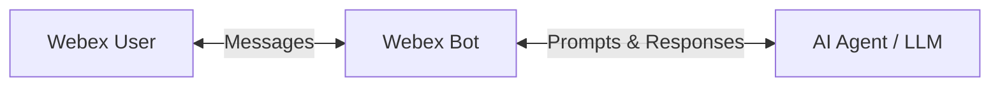

# Lab 5 - Integrate an AI Assistant with a Webex Bot

Up to this point, you have built and tested your AI assistant in Visual Studio Code: official MCP servers, Webex APIs, and a custom MCP server. In this section, you will start writing Python to connect that intelligence to a Webex Bot, so users can interact with your assistant from any Webex space.

## Architecture



### Choosing the Right Interface

| Interface | Context | Best for |
| --- | --- | --- |
| **Web Chat** (e.g., claude.ai) | Manual prompts and pasted content | General questions, brainstorming, one-off code |
| **IDE** (Labs 1–3) | VS Code Chat, MCP servers, API testing | Development, tool design, and testing the assistant |
| **Webex Bot** (This lab) | Webex spaces, Adaptive Cards, always-on | End-user interaction, operational tasks, collaborative workflows |

!!! Note "Bot vs. Agent"
    A **bot** is the interaction channel in Webex. An **agent** is the system that reasons, plans, calls tools, and validates results behind the bot.

The bot handles **transport**. The agent handles **reasoning and tool selection**.

## Step 5.1: Create a Bot

First, you need to create your bot:

1. Log into [developer.webex.com](https://developer.webex.com/){:target="_blank"} with the credentials that were provided.
2. In the top right corner of the page, click your avatar and then select [My Webex Apps](https://developer.webex.com/my-apps){:target="_blank"}.
3. On the ‘Create a New App’ page, find the Bot card and click the ‘Create a Bot’ button.

    { width="850" style="display: block; margin: 0 auto; border: 1px solid lightgray; border-radius: 8px;" }

4. Fill out the web form to register a new bot:
   
    1. **Bot Name:** WebexOne-*USERNAME*
    2. **Bot Username:** WebexOne-*USERNAME*
    3. **Icon:** *Select any color icon*.
    4. **Description**: “Bot for WebexOne”
  
    Click **Add Bot** now.

    { width="850" style="display: block; margin: 0 auto; border: 1px solid lightgray; border-radius: 8px;" }
    
    !!! Warning
        Do not close this window without copying the **Bot access token**.

5. In VS Code, make sure your terminal is in the correct folder:

    * cd ../05_bot

6. Open the `.env` file at the root of your project and copy the bot access token into it:

    ```env
    BOT_TOKEN=your_bot_access_token
    ```

## Step 5.2: WebSocket Client

As discussed, we will be using WebSockets in this lab. WebSockets will keep a communication channel open with Cisco to receive and send messages. We will be using the following class during this lab to run the bot.

1. Navigate to `05_bot/websocket_client.py` and review the code:

    ??? Tip "Python Code"
        ```python
        import asyncio
        import base64
        import json
        import logging
        import ssl
        import uuid
        
        import certifi
        import requests
        import websockets
        
        log = logging.getLogger(__name__)
        
        API_URL = "https://webexapis.com/v1"
        # Host map for the org: used to find the WDM URL that issues Webex WebSocket devices.
        CATALOG_URL = "https://u2c.wbx2.com/u2c/api/v1/catalog?format=hostmap"
        # Payload Webex expects when creating a desktop "device" that can open Mercury.
        DEVICE_DATA = {
            "deviceName": "pywebsocket-client",
            "deviceType": "DESKTOP",
            "localizedModel": "python",
            "model": "python",
            "name": "python-spark-client",
            "systemName": "python-spark-client",
            "systemVersion": "0.1",
        }
        
        class WebSocketClient:
            """Opens a Webex Mercury WebSocket and calls on_message(message) for each new post."""
        
            def __init__(self, access_token, on_message):
                self.access_token = access_token
                self.on_message = on_message  # callback(message) for each incoming post
                self.session = requests.Session()
                self.session.headers.update({"Authorization": f"Bearer {access_token}"})
                self.me = self.session.get(f"{API_URL}/people/me").json()
                self.cluster, _, self.person_uuid = base64.b64decode(self.me["id"] + "==").decode().split("/")[2:]
                self.clusters = None
        
            def _cluster_of(self, hydra_id):
                return base64.b64decode(hydra_id + "==").decode().split("/")[2]
        
            def _room_clusters(self):
                clusters, url, params = [], f"{API_URL}/rooms", {"max": 100}
                for _ in range(5):
                    response = self.session.get(url, params=params)
                    if not response.ok:
                        break
                    for room in response.json().get("items", []):
                        cluster = self._cluster_of(room["id"])
                        if cluster not in clusters:
                            clusters.append(cluster)
                    url = response.links.get("next", {}).get("url")
                    if not url:
                        break
                    params = None
                return clusters
        
            def _candidate_clusters(self, activity):
                # The event's own cluster first, then the bot's, then the clusters its spaces live in.
                candidates = []
                for node in (activity, activity.get("target"), activity.get("object")):
                    global_id = node.get("globalId") if isinstance(node, dict) else None
                    if isinstance(global_id, str) and "/" in global_id:
                        candidates.append(global_id.split("/")[0])
                candidates.append(self.cluster)
                if self.clusters is None:
                    self.clusters = self._room_clusters()
                candidates.extend(self.clusters)
                return list(dict.fromkeys(candidates))
        
            def get_message(self, activity):
                # A space shared with another org keeps that org's cluster, not the bot's.
                for _ in range(2):
                    for cluster in self._candidate_clusters(activity):
                        hydra_id = base64.b64encode(f"ciscospark://{cluster}/MESSAGE/{activity['id']}".encode()).decode()
                        response = self.session.get(f"{API_URL}/messages/{hydra_id}")
                        if response.ok:
                            return response.json()
                    self.clusters = None
                log.warning(f"Could not read message {activity['id']} in any known cluster")
                return None
        
            def send_message(self, room_id, text):
                # POST a text message back into the same space.
                self.session.post(f"{API_URL}/messages", json={"roomId": room_id, "text": text})
        
            async def listen(self):
                # 1) Ask the catalog where device registration lives for this org.
                wdm_url = self.session.get(CATALOG_URL).json()["serviceLinks"]["wdm"]
                # 2) Register a device; the response includes the Mercury WebSocket URL.
                device = self.session.post(f"{wdm_url}/devices", json=DEVICE_DATA).json()
                # 3) Verify TLS with certifi (Python's default store often misses these CAs).
                ssl_context = ssl.create_default_context(cafile=certifi.where())
        
                async with websockets.connect(device["webSocketUrl"], ssl=ssl_context) as ws:
                    # 4) Authorize the socket with the bot token before events start flowing.
                    await ws.send(json.dumps({
                        "id": str(uuid.uuid4()),
                        "type": "authorization",
                        "data": {"token": f"Bearer {self.access_token}"},
                    }))
                    # 5) Fetch each new post in plaintext and hand it to the bot.
                    async for raw in ws:
                        data = json.loads(raw).get("data", {})
                        if data.get("eventType") != "conversation.activity":
                            continue
                        activity = data["activity"]
                        # Only new posts, and never the bot's own replies (avoids an echo loop).
                        if activity["verb"] != "post" or activity["actor"]["id"] == self.person_uuid:
                            continue
                        message = self.get_message(activity)
                        if message:
                            self.on_message(message)
        
            def run(self):
                asyncio.run(self.listen())
        ```

!!! Note
    This lab uses **WebSockets (Mercury)** so no public URL or ngrok tunnel is required. For production, you may use [webhooks](https://developer.webex.com/messaging/docs/api/guides/webhooks){:target="_blank"} instead.

## Step 5.3: Echo

In this exercise, we will create a bot that will echo back the same message using the WebSocket class shown above.

1. Navigate to `05_bot/01_echo.py` and review the code:

    ??? Tip "Python Code"
        ```python    
        import logging
        import os
        
        from dotenv import load_dotenv
        
        from websocket_client import WebSocketClient
        
        logging.basicConfig(level=logging.INFO, format="%(asctime)s %(levelname)s %(message)s")
        log = logging.getLogger("echo-bot")
        
        load_dotenv()
        
        BOT_TOKEN = os.getenv("BOT_TOKEN")
        if not BOT_TOKEN:
            raise SystemExit("Set BOT_TOKEN in your .env file")
        
        def handle_message(message):
            # message is the decrypted Webex message: text, roomId, personEmail, ...
            text = (message.get("text") or "").strip()
            if not text:
                return
        
            sender = message["personEmail"]
            log.info(f"Received from {sender}: {text}")
        
            reply = f"Echo: {text}"
            bot.send_message(message["roomId"], reply)
            log.info(f"Sent to {sender}: {reply}")
        
        if __name__ == "__main__":
            bot = WebSocketClient(access_token=BOT_TOKEN, on_message=handle_message)
            log.info(f"Listening as {bot.me['emails'][0]} via WebSocket... (Ctrl+C to stop)")
            try:
                bot.run()
            except KeyboardInterrupt:
                log.info("Stopped.")
        ```

2. Run your code with the following command:

    * python 01_echo.py

3. Now your bot is actively listening. Look for your bot and send it a message:

    { width="550" style="display: block; margin: 0 auto; border: 1px solid lightgray; border-radius: 8px;" }

4. You should instantly get an answer:

    { width="350" style="display: block; margin: 0 auto; border: 1px solid lightgray; border-radius: 8px;" }

5. You can see something similar in the terminal:

    ```bash
    2026-09-09 14:07:21,970 INFO Listening as webexone-diejimen@webex.bot via WebSocket... (Ctrl+C to stop)
    2026-09-09 14:07:29,407 INFO Received from diejimen@cisco.com: Hello
    2026-09-09 14:07:29,925 INFO Sent to diejimen@cisco.com: Echo: Hello
    ```
6. You can press `Ctrl+C` to stop the bot.

## Step 5.4: LLM

You have seen how a bot works, but now we will make it "smarter". To enable it to perform actions, we will integrate the bot with an LLM, which will act as the brain of our assistant. 

In this scenario, we will be using OpenAI models, specifically **gpt-5-nano**.

!!! Warning
    If you try to change the model, you will get a **403** error.

1. Open the `.env` file at the root of your project and set the `OPENAI_API_KEY`:

    ```env
    OPENAI_API_KEY=your_openai_api_key
    ```
    
2. Navigate to `05_bot/02_llm.py` and review the code:

    ??? Tip "Python Code"
        ```python    
        import logging
        import os
        
        import requests
        from dotenv import load_dotenv
        
        from websocket_client import WebSocketClient
        
        # Prefer the OS trust store (Windows/macOS/Linux) so company HTTPS inspection, whose CA
        # lives there but not in certifi, still verifies. Falls back to certifi if unavailable.
        try:
            import truststore
        
            truststore.inject_into_ssl()
        except ImportError:
            pass
        
        load_dotenv()
        
        OPENAI_URL = "https://api.openai.com/v1/chat/completions"
        OPENAI_MODEL = os.getenv("OPENAI_MODEL", "gpt-5-nano")
        ERROR_REPLY = "Sorry, I could not reach the AI service right now. Please try again in a moment."
        
        logging.basicConfig(level=logging.INFO, format="%(asctime)s %(levelname)s %(message)s")
        log = logging.getLogger("llm-bot")
        
        BOT_TOKEN = os.getenv("BOT_TOKEN")
        OPENAI_API_KEY = os.getenv("OPENAI_API_KEY")
        if not BOT_TOKEN:
            raise SystemExit("Set BOT_TOKEN in your .env file")
        if not OPENAI_API_KEY:
            raise SystemExit("Set OPENAI_API_KEY in your .env file")
        
        
        def ask_llm(user_text: str) -> str:
            response = requests.post(
                OPENAI_URL,
                headers={
                    "Authorization": f"Bearer {OPENAI_API_KEY}",
                    "Content-Type": "application/json",
                },
                json={
                    "model": OPENAI_MODEL,
                    "messages": [{"role": "user", "content": user_text}],
                },
                timeout=60,
            )
            response.raise_for_status()
            return response.json()["choices"][0]["message"]["content"]
        
        
        def handle_message(message):
            text = (message.get("text") or "").strip()
            if not text:
                return
        
            sender = message["personEmail"]
            log.info(f"Received from {sender}: {text}")
        
            try:
                reply = ask_llm(text)
            except requests.exceptions.SSLError:
                log.error(
                    "TLS verification failed. If your company inspects HTTPS traffic, install the "
                    "requirements (truststore) or point SSL_CERT_FILE at your corporate CA bundle."
                )
                reply = ERROR_REPLY
            except Exception:
                log.exception("LLM call failed")
                reply = ERROR_REPLY
        
            bot.send_message(message["roomId"], reply)
            log.info(f"Sent to {sender}: {reply}")
        
        
        if __name__ == "__main__":
            bot = WebSocketClient(access_token=BOT_TOKEN, on_message=handle_message)
            log.info(f"Listening as {bot.me['emails'][0]} via WebSocket... (Ctrl+C to stop)")
            log.info(f"OpenAI model: {OPENAI_MODEL}")
            try:
                bot.run()
            except KeyboardInterrupt:
                log.info("Stopped.")
        ```

3. Run your code with the following command:

    * python 02_llm.py

4. In the same conversation you opened earlier, text your bot, and you should instantly get an answer:
   
    { width="750" style="display: block; margin: 0 auto; border: 1px solid lightgray; border-radius: 8px;" }

5. You can see something similar in the terminal:

    ```bash
    2026-09-13 14:44:01,915 INFO Received from diejimen@cisco.com: Hello
    2026-09-13 14:44:05,830 INFO Sent to diejimen@cisco.com: Hi there! 👋 How can I help today?
    
    I can: 
    - answer questions and explain topics
    - help with writing, editing, or brainstorming
    - assist with math, coding, or debugging
    - translate or summarize text
    - plan projects or study goals
    - chat about nearly anything
    
    Tell me what you’re working on or ask me to do something, and we’ll start from there.
    ```

6. You can press `Ctrl+C` to stop the bot.

## Extra: Security

So far, we have not introduced any security; therefore, any user inside or outside your organization is currently able to run queries against your assistant.

You may want to introduce some security, not only to prevent users outside your organization from accessing it, but also to restrict specific calls to admins only.

1. Navigate to `05_bot/03_security.py` and review the code:

    ??? Tip "Python Code"
        ```python
        import logging
        import os
        
        from dotenv import load_dotenv
        
        from websocket_client import WebSocketClient
        
        logging.basicConfig(level=logging.INFO, format="%(asctime)s %(levelname)s %(message)s")
        log = logging.getLogger("security-bot")
        
        load_dotenv()
        
        BOT_TOKEN = os.getenv("BOT_TOKEN")
        if not BOT_TOKEN:
            raise SystemExit("Set BOT_TOKEN in your .env file")
        
        DENIED_DOMAIN_REPLY = "This bot only accepts messages from allowed organization domains."
        DENIED_ADMIN_REPLY = "This bot only accepts messages from allowed users."
        
        def parse_csv(value: str) -> set[str]:
            return {item.strip().lower() for item in (value or "").split(",") if item.strip()}
        
        ALLOWED_DOMAINS = parse_csv(os.getenv("ALLOWED_DOMAINS", ""))
        ALLOWED_ADMINS = parse_csv(os.getenv("ALLOWED_ADMINS", ""))
        
        def sender_domain(email: str) -> str:
            if not email or "@" not in email:
                return ""
            return email.rsplit("@", 1)[-1].strip().lower()
        
        
        def is_allowed_sender(email: str) -> bool:
            """True when no domain list is set, or the sender's domain is in ALLOWED_DOMAINS."""
            if not ALLOWED_DOMAINS:
                return True
            return sender_domain(email) in ALLOWED_DOMAINS
        
        
        def is_admin(email: str) -> bool:
            """True when no admin list is set, or the sender is listed in ALLOWED_ADMINS."""
            if not ALLOWED_ADMINS:
                return True
            return (email or "").strip().lower() in ALLOWED_ADMINS
        
        def handle_message(message):
            text = (message.get("text") or "").strip()
            if not text:
                return
        
            sender = message.get("personEmail") or ""
            log.info(f"Received from {sender}: {text}")
        
            if not is_allowed_sender(sender):
                log.warning(f"Rejected (domain): {sender}")
                bot.send_message(message["roomId"], DENIED_DOMAIN_REPLY)
                return
        
            if not is_admin(sender):
                log.warning(f"Rejected (user): {sender}")
                bot.send_message(message["roomId"], DENIED_ADMIN_REPLY)
                return
        
            reply = f"Authorized ({sender_domain(sender)}): {text}"
            bot.send_message(message["roomId"], reply)
            log.info(f"Sent to {sender}: {reply}")
        
        
        if __name__ == "__main__":
            bot = WebSocketClient(access_token=BOT_TOKEN, on_message=handle_message)
            log.info(f"Listening as {bot.me['emails'][0]} via WebSocket... (Ctrl+C to stop)")
            log.info(f"Allowed domains: {', '.join(sorted(ALLOWED_DOMAINS)) or '(all)'}")
            log.info(f"Admins: {', '.join(sorted(ALLOWED_ADMINS)) or '(all)'}")
            try:
                bot.run()
            except KeyboardInterrupt:
                log.info("Stopped.")
        ```

2. Add different domains and admins to your `.env` file at the root of your project to test the access:

    ```env
    ALLOWED_DOMAINS=webexone-ai-assistant.wbx.ai
    ALLOWED_ADMINS=admin@webexone-ai-assistant.wbx.ai
    ```

3. Run your code with the following command:

    * python 03_security.py
   
4. You will get an answer, but it will be the pre-determined rejection message:

    { width="650" style="display: block; margin: 0 auto; border: 1px solid lightgray; border-radius: 8px;" }

---

In the next section, we will give our bot capabilities from the Webex MCP servers.
