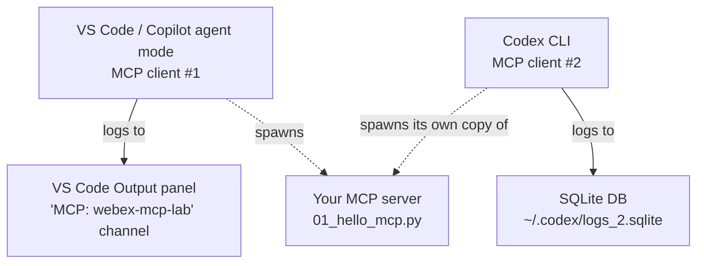

# Using Codex as an MCP client (and reading its logs)

A companion to [mcp-setup-and-tracing.md](mcp-setup-and-tracing.md). That guide
covers running the `webex-mcp-lab` server under **GitHub Copilot** in VS Code.
This one covers the alternative: driving the same server from **OpenAI Codex**,
with your own OpenAI API key — no Copilot, no ChatGPT subscription required —
and, most importantly, **where Codex actually writes its MCP logs**.

> Verified against **Codex CLI 0.150.1** on Windows. Paths and log layout changed
> significantly from older versions; see the notes below.

---

## 1. The mental model: two separate MCP clients

The single biggest source of confusion: **VS Code/Copilot and Codex are two
different MCP clients.** They each spawn their *own* copy of your server and
write to *completely separate* logs.



- The **`MCP: webex-mcp-lab`** channel in VS Code Output belongs to **Copilot**.
  Codex never writes there.
- Codex writes to its own store under `~/.codex/` (see §5).

---

## 2. Install Codex and log in with an API key

Codex is a separate program from the VS Code extension. Install the CLI:

```powershell
npm install -g @openai/codex
codex --version
```

Log in with a plain OpenAI API key (no ChatGPT subscription needed). The
`--with-api-key` flag reads the key from **stdin**; PowerShell has no `printenv`,
so use `Write-Output`:

```powershell
$env:OPENAI_API_KEY = "sk-your-real-key-here"   # type your real key yourself
Write-Output $env:OPENAI_API_KEY | codex login --with-api-key
codex login status                               # must say "Logged in using an API key"
```

Verify the check first if login seems to do nothing (an empty key silently
fails after printing `starting api key login flow`):

```powershell
$env:OPENAI_API_KEY.Length     # should be a number like 51, not 0
```

A successful login creates `C:\Users\<you>\.codex\auth.json`.

> Security: type the key directly into your terminal. Prefer `$env:` / `setx`
> over pasting it inline in a pipe so it doesn't linger in shell history.

---

## 3. Register the MCP server (`config.toml`)

Codex does **not** read VS Code's `mcp.json`. It reads
`C:\Users\<you>\.codex\config.toml`. Add the lab server under an
`[mcp_servers.<name>]` table:

```toml
[mcp_servers.webex-mcp-lab]
command = "C:/WorkRelated_LocalFiles/wx1Simple/WebexOne2026/webex-mcp-lab/.venv/Scripts/python.exe"
args = ["01_hello_mcp.py"]
cwd = "C:/WorkRelated_LocalFiles/wx1Simple/WebexOne2026/webex-mcp-lab"
```

Confirm Codex sees it:

```powershell
codex mcp list
```

No `mcp_servers` entry = Codex never spawns your server = **zero MCP logs** in
any surface. This is the #1 reason "there are no MCP logs."

---

## 4. Run it

```powershell
codex
```

Then, in the Codex TUI, prompt it to use the tool, e.g.:

```
use MCP to greet
```

Codex launches your server, loads its tool catalog, asks you to approve the
tool call, then runs `greet`.

---

## 5. Where Codex writes its logs (the important part)

**There is no `codex-tui.log` by default in 0.150.x.** The old
`~/.codex/log/codex-tui.log` path is obsolete. Instead:

| Location | Contents |
| --- | --- |
| `~/.codex/logs_2.sqlite` (table `logs`) | **Primary log store.** All structured INFO/DEBUG/TRACE, including MCP client activity. |
| `~/.codex/sessions/YYYY/MM/DD/rollout-*.jsonl` | Full session transcript (prompts, responses, tool calls). |
| `~/.codex/log/codex-login.log` | Only the login flow. |
| `~/.codex/log/codex-tui.log` | **Opt-in** plaintext log — only created when you set `log_dir` (see §7). |

The `logs` table schema:

```
id, ts, ts_nanos, level, target, feedback_log_body,
module_path, file, line, thread_id, process_uuid, estimated_bytes
```

The MCP-relevant `target`s to look for:

- `codex_rmcp_client::stdio_server_launcher` — server process + captured stderr
- `codex_mcp::connection_manager::tool_catalog` — tool discovery
- `rmcp::service` — the MCP protocol layer
- `codex_app_server::outgoing_message` — `mcpServer/startupStatus`, elicitation

A healthy MCP run looks like this in the store:

```
codex_rmcp_client::stdio_server_launcher  MCP server stderr (...python.exe): webex-mcp-lab-01 running on stdio
codex_app_server::outgoing_message        app-server event: mcpServer/startupStatus/updated targeted_connections=1
codex_core::session::handlers             UserInput ... "use MCP to greet"
codex_app_server::outgoing_message        McpServerElicitationRequest ... Accept
codex_core::session::handlers             ResolveElicitation { server_name: "webex-mcp-lab", decision: Accept }
```

---

## 6. Reading `logs_2.sqlite`

It's a standard SQLite database. Options:

### Helper script (MCP-focused) — recommended
[show_codex_mcp_logs.py](show_codex_mcp_logs.py) filters to MCP rows, prints to
console, **and writes a `.log` file**:

```powershell
$py  = "C:/WorkRelated_LocalFiles/wx1Simple/WebexOne2026/webex-mcp-lab/.venv/Scripts/python.exe"
$log = "C:/WorkRelated_LocalFiles/wx1Simple/WebexOne2026/webex-mcp-lab/lab-guide/show_codex_mcp_logs.py"

& $py $log            # last 50 MCP entries  -> codex-mcp.log (overwrite)
& $py $log --all      # full history         -> codex-mcp.log (overwrite)
& $py $log --follow   # live tail            -> codex-mcp.log (append)
& $py $log --out "C:\path\to\trace.log"      # custom log file
```

For a live demo: run `--follow`, then type `use MCP to greet` in the Codex
terminal and watch the launch -> approval -> call sequence stream in.

### VS Code SQLite Viewer
Installed via `code --install-extension qwtel.sqlite-viewer`. Open the DB:

```powershell
code "$env:USERPROFILE\.codex\logs_2.sqlite"
```

Click the `logs` table; sort/filter the `target` column for `mcp`/`rmcp`.

### Raw SQL (read-only)
Always open read-only while Codex is running to avoid locks:

```sql
-- sqlite3 "%USERPROFILE%\.codex\logs_2.sqlite"
.headers on
.mode column
SELECT datetime(ts,'unixepoch','localtime') t, level, target,
       substr(feedback_log_body,1,120)
FROM logs
WHERE target LIKE '%mcp%' OR target LIKE '%rmcp%'
ORDER BY id DESC LIMIT 30;
```

---

## 7. Getting DEBUG/TRACE instead of only INFO

Verbosity is controlled by the **`RUST_LOG`** environment variable (official:
*"RUST_LOG — CLI and app-server — Controls Rust log filtering and verbosity"*).
Two gotchas make it look like it "doesn't work":

1. **PowerShell syntax.** `RUST_LOG=debug codex` is bash-only. In PowerShell set
   it on its own line:
   ```powershell
   $env:RUST_LOG = "debug"
   ```
2. **The app-server daemon persists.** Codex keeps a shared **app-server**
   process alive between runs, and the MCP client lives inside it. A new
   `RUST_LOG` is ignored until that daemon **restarts**. Close the running
   `codex` (or `Stop-Process -Name codex -Force`) before relaunching.

Recommended MCP-scoped filter (less noise than global `trace`):

```powershell
Get-Process codex -ErrorAction SilentlyContinue | Stop-Process -Force
$env:RUST_LOG = "codex_rmcp_client=trace,rmcp=trace,codex_mcp=trace,codex_app_server=debug,info"
codex -c log_dir="C:/WorkRelated_LocalFiles/wx1Simple/WebexOne2026/webex-mcp-lab/.codex-log"
```

`-c log_dir=...` also enables the **opt-in plaintext** `codex-tui.log`:

```powershell
Get-Content "C:/WorkRelated_LocalFiles/wx1Simple/WebexOne2026/webex-mcp-lab/.codex-log/codex-tui.log" -Wait -Tail 50
```

Make it persistent across terminals (open a **new** terminal afterward, and
ensure no old `codex` is running):

```powershell
setx RUST_LOG "codex_rmcp_client=trace,rmcp=trace,codex_mcp=trace,info"
```

Verify the level took effect:

```powershell
& $py $log --all    # DEBUG/TRACE counts should rise for the MCP targets
```

---

## 8. Troubleshooting

| Symptom | Cause / fix |
| --- | --- |
| `codex` not recognized | CLI not installed — `npm install -g @openai/codex`. |
| "Not logged in" after login | Empty key piped. Check `$env:OPENAI_API_KEY.Length`, re-run `Write-Output ... \| codex login --with-api-key`. |
| No MCP logs anywhere | No `mcp_servers` entry in `config.toml`, or no session invoked the tool. |
| `codex-tui.log` missing | It's opt-in — launch with `-c log_dir=...`. |
| Only INFO in `logs_2.sqlite` | Raise `RUST_LOG` **and restart the app-server** (kill running `codex`). |
| `$env:RUST_LOG` ignored | Old `codex`/app-server still running; stop it first. Don't use bash `VAR=val cmd` syntax in PowerShell. |
| Logs in "another host" line only | That console line is the login flow; real logs are in `logs_2.sqlite`. |

---

## 9. Quick reference

| Thing | Value |
| --- | --- |
| Install | `npm install -g @openai/codex` |
| Login | `Write-Output $env:OPENAI_API_KEY \| codex login --with-api-key` |
| Server config | `~/.codex/config.toml` → `[mcp_servers.webex-mcp-lab]` |
| List servers | `codex mcp list` |
| Primary logs | `~/.codex/logs_2.sqlite` (table `logs`) |
| Session transcript | `~/.codex/sessions/**/rollout-*.jsonl` |
| Verbosity | `$env:RUST_LOG="debug"` + restart app-server |
| Plaintext log | `codex -c log_dir=...` → `codex-tui.log` |
| MCP log helper | [show_codex_mcp_logs.py](show_codex_mcp_logs.py) |

---

*Related: [lab-guide.md](lab-guide.md) · [mcp-setup-and-tracing.md](mcp-setup-and-tracing.md)*
